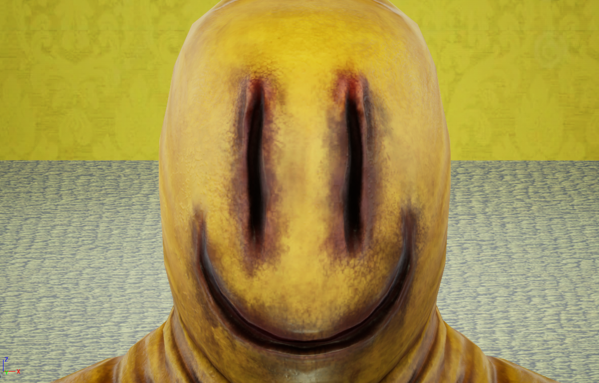

# Survive the Backrooms!
by Umut Osmanoglu and Yann Dechaux

## Synopsis
A random guy noclips out of reality, and finds himself stuck in a room full of strange monsters called " Party-Goers", and with only a bat to defend himself. Will he make it?

|     Controls     |                    		     |
|------------------|---------------------------------|
|W				   |`Move Forward`           		 |
|S				   |`Move Backward`          		 |
|D				   |`Move Right`					 |
|A				   |`Move Left`					     |
|Left Control	   |`Walk`						     |
|Left Mouse Button |`Attack`						 |
|Right Mouse Button|`Block`							 |

## Editor
*(Blueprint generated from C++)*
Enemies variable --> Assets/Enemy/MyAINPC 
Player variable --> _Main/Blueprints/BP_PlayerGladiator 
Game variable --> _Main/Blueprints/BP_GladiatorGameModeBase 